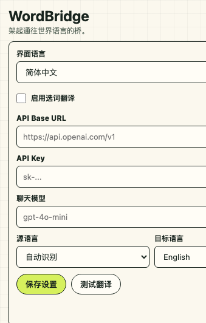

# WordBridge

[中文](#中文) | [English](#english)

## 中文

WordBridge 是一个 Manifest V3 Chrome 扩展。选中网页文字后，它会调用 OpenAI 兼容的聊天接口，按源语言和目标语言设置翻译或解释，并显示音标、例句、近义词和语音播放按钮。

### 功能

- 选中网页文字后自动弹出翻译浮窗
- 可在设置页启用或禁用选词翻译
- 设置改动会自动保存，也可手动点击保存设置
- 默认按住 Ctrl/⌘ 双击触发翻译，也可改为自动选中或按住 Ctrl/⌘ 选中
- 设置页支持简中、繁中、英文、日文、韩文、法文、德文、西文、葡文、意文、俄文、阿语、印地语、越南语、泰语界面
- 可配置源语言和目标语言，源语言支持自动识别
- 英文到英文时会用简单英文解释
- 其他语言方向会按目标语言翻译并给出简短说明
- 显示 IPA 音标、简单例句、候选表达
- 使用浏览器自带语音朗读
- 可配置 OpenAI 兼容 `baseUrl`、`apiKey`、聊天模型和翻译语言
- 使用本地缓存保存最近查询结果，重复查询可减少 API 请求

### 安装

1. 打开 Chrome 的 `chrome://extensions`
2. 打开右上角“开发者模式”
3. 点击“加载已解压的扩展程序”
4. 选择当前目录：`/Users/zwd321081/Documents/cloudmusic/projects/worldbridge`
5. 点击扩展图标，填写接口配置并保存

### 接口配置

默认配置：

- `API Base URL`: `https://api.openai.com/v1`
- `聊天模型`: `gpt-4o-mini`

如果使用其他 OpenAI 兼容服务，把 `API Base URL` 改成该服务的 OpenAI 兼容地址，并填写对应模型名和 Key。

### 文件结构

- `manifest.json`: Chrome 扩展声明
- `icons/`: WordBridge 图标源文件和 Chrome 图标尺寸
- `background.js`: 调用大模型翻译并提供浏览器朗读语言
- `content.js`: 监听页面选词并渲染浮窗
- `content.css`: 内容脚本隔离样式
- `options.html`: 设置页
- `options.css`: 设置页样式
- `options.js`: 设置保存和接口测试

### 注意

API Key 和接口配置保存在 Chrome 扩展的同步存储 `chrome.storage.sync` 中，不会写入本项目文件。翻译缓存保存在 `chrome.storage.local`，仅保留最近查询结果，默认 10 分钟过期，最多 300 条。若 Chrome 开启账号同步，接口配置可能同步到同一账号的其他 Chrome 浏览器。适合个人使用，不要把带有真实 Key 的浏览器配置或打包扩展分享给别人。

## English

WordBridge is a Manifest V3 Chrome extension. When you select text on a webpage, it calls an OpenAI-compatible chat API, translates or explains the selection according to your language settings, and shows IPA, examples, related words, and a speech button.

### Features

- Shows a translation popup after selecting text on a webpage
- Can enable or disable selection lookup from the settings page
- Settings changes are auto-saved, with a manual Save button still available
- Default trigger is holding Ctrl/⌘ and double-clicking; users can switch to automatic selection or holding Ctrl/⌘ and selecting
- Settings UI supports Simplified Chinese, Traditional Chinese, English, Japanese, Korean, French, German, Spanish, Portuguese, Italian, Russian, Arabic, Hindi, Vietnamese, and Thai
- Configurable source and target languages, with auto-detection for the source language
- Explains English in simple English when translating English to English
- Translates other language directions into the selected target language with a short explanation
- Shows IPA, simple examples, and related expressions
- Uses the browser's built-in speech synthesis
- Supports OpenAI-compatible `baseUrl`, `apiKey`, chat model, and language settings
- Caches recent lookup results locally to reduce repeated API requests

### Installation

1. Open `chrome://extensions` in Chrome
2. Enable Developer mode
3. Click Load unpacked
4. Select this directory: `/Users/zwd321081/Documents/cloudmusic/projects/worldbridge`
5. Click the extension icon, fill in the API settings, and save

### API Settings

Default settings:

- `API Base URL`: `https://api.openai.com/v1`
- `Chat model`: `gpt-4o-mini`

For another OpenAI-compatible provider, set `API Base URL` to that provider's OpenAI-compatible endpoint and enter the matching model name and API key.

### Project Structure

- `manifest.json`: Chrome extension manifest
- `icons/`: WordBridge icon source and Chrome icon sizes
- `background.js`: Calls the language model and provides browser speech language hints
- `content.js`: Watches webpage text selection and renders the popup
- `content.css`: Isolated content script styles
- `options.html`: Settings page
- `options.css`: Settings page styles
- `options.js`: Settings persistence and API testing

### Security Note

API keys and settings are stored in Chrome extension sync storage, `chrome.storage.sync`, and are not written to files in this project. Translation cache entries are stored in `chrome.storage.local`, keep recent lookup results only, expire after 10 minutes by default, and are capped at 300 items. If Chrome account sync is enabled, API settings may sync to other Chrome browsers under the same account. This extension is intended for personal use; do not share a browser profile or packaged extension that contains a real API key.
